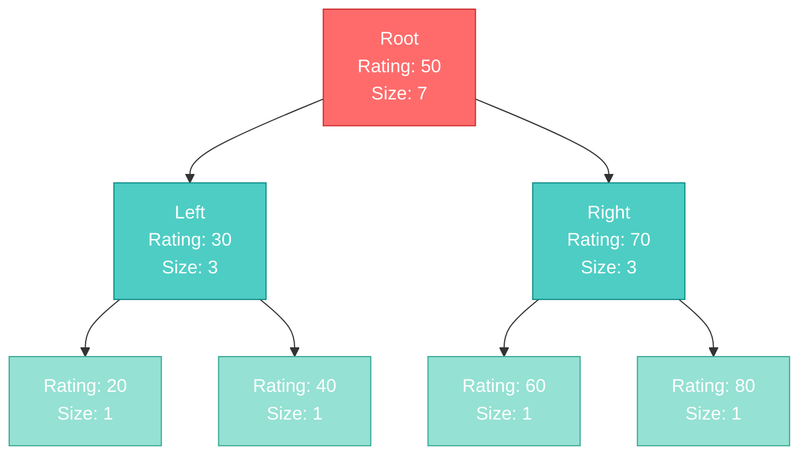
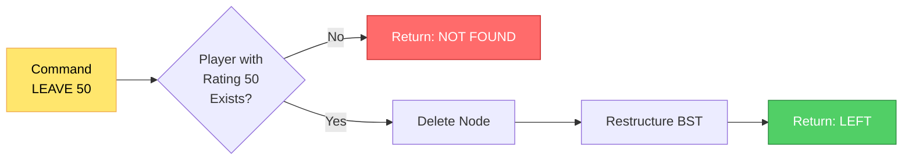
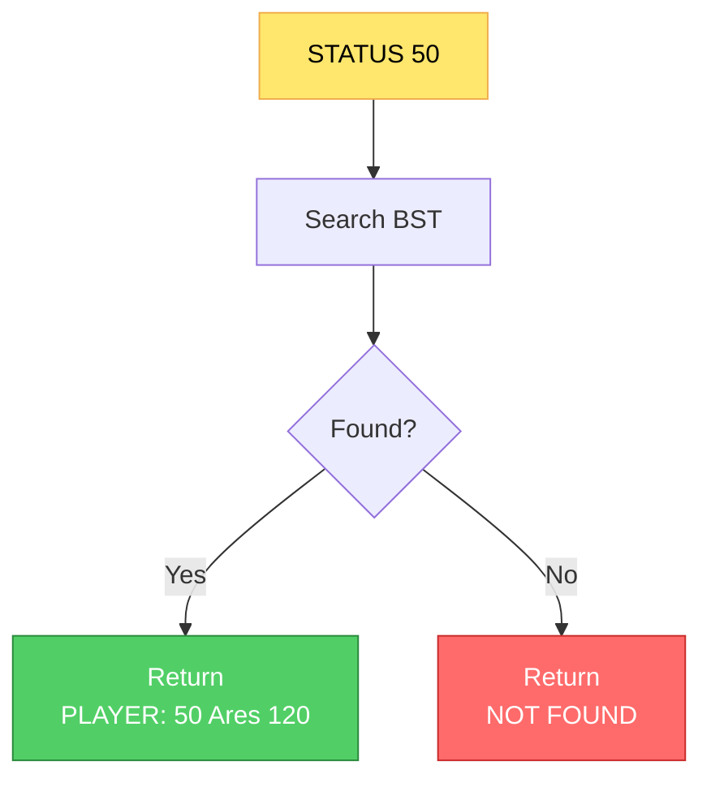
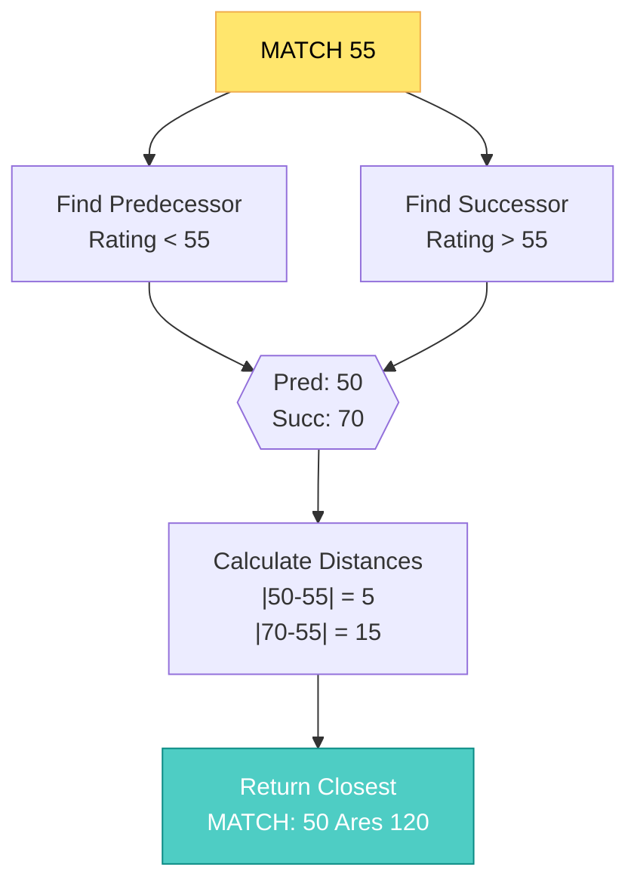
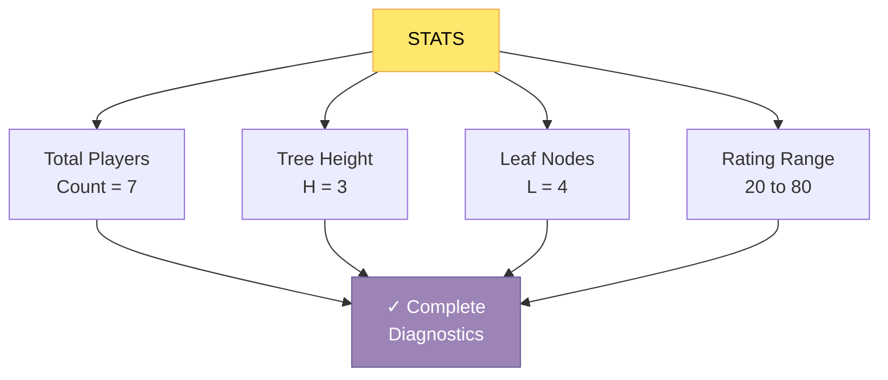
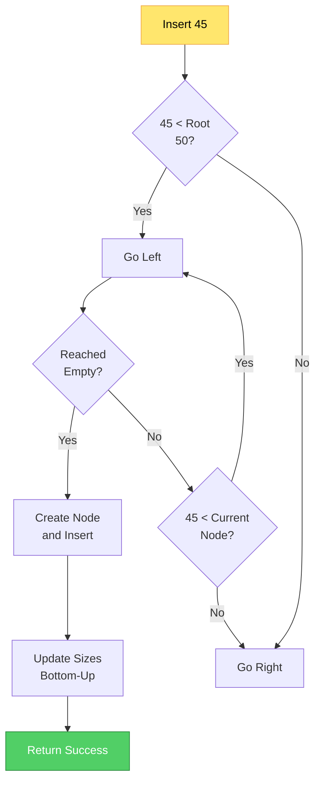
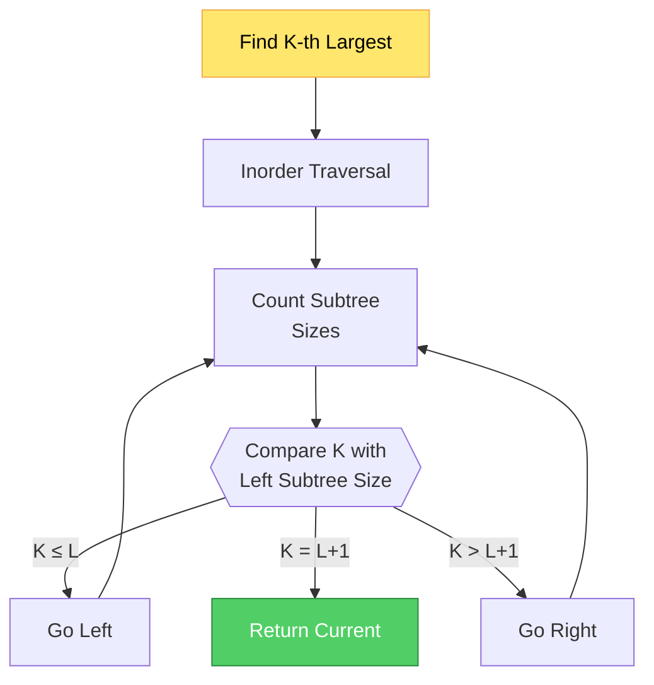
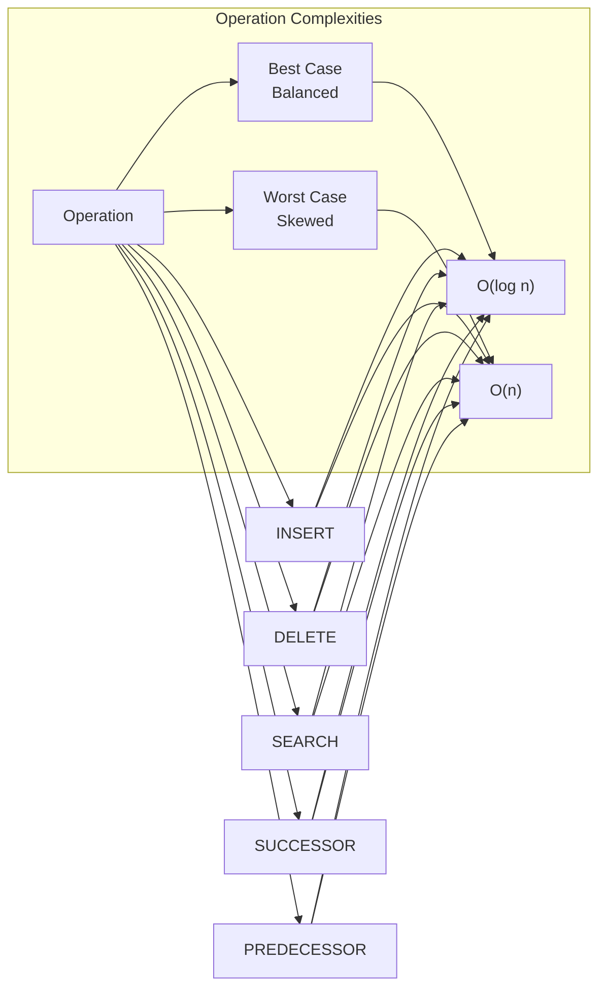
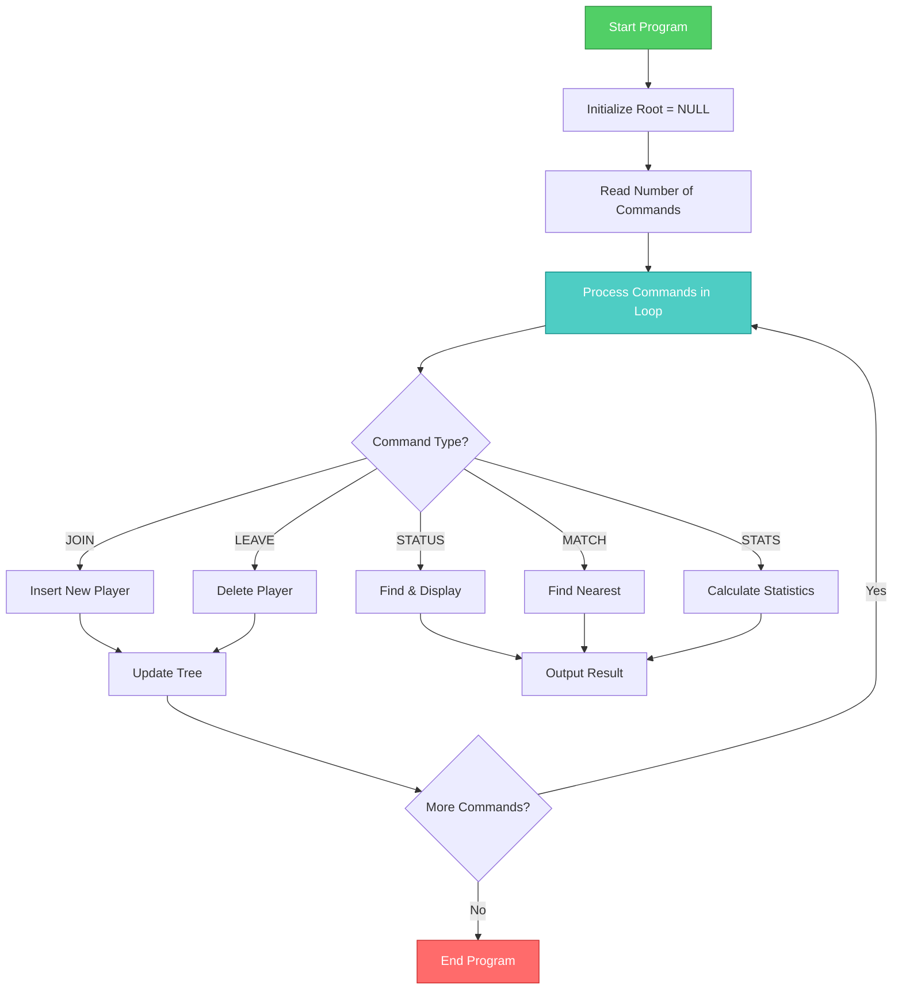

# ⚔️ ARENA OF RATINGS - Game Engine

> **A Pointer-Based Binary Search Tree Implementation for Epic Player Matchmaking**

*Built by Muhammad Zafran | Your Partner for Academic Success*

---

## 🎮 Overview

**Arena of Ratings** is a sophisticated game engine that manages player rankings using a customized Binary Search Tree (BST) data structure. This system efficiently handles player registrations, removals, matchmaking, and statistical analysis in a dynamic competitive arena.

```
                    ┌─────────────────────────┐
                    │   ARENA OF RATINGS      │
                    │   Powered by BST        │
                    └────────────┬────────────┘
                                 │
                    ┌────────────┴────────────┐
                    │   Player Management     │
                    │   • JOIN / LEAVE        │
                    │   • STATUS CHECK        │
                    │   • MATCHMAKING         │
                    └────────────┬────────────┘
                                 │
                    ┌────────────┴────────────┐
                    │   BST Operations        │
                    │   • Insert / Remove     │
                    │   • Search / Traverse   │
                    │   • Find Nearest Match  │
                    └─────────────────────────┘
```

---

## 🌳 Data Structure Architecture

### Node Structure

Each player in the arena is represented as a node with the following attributes:

```
┌──────────────────────────────────┐
│         Player Node              │
├──────────────────────────────────┤
│  rating    : int                 │
│  name      : string              │
│  hp        : long long           │
│  left      : Node*               │
│  right     : Node*               │
│  sz        : int (subtree size)  │
└──────────────────────────────────┘
```

### Binary Search Tree Organization



**Key Property:** For every node, all ratings in the left subtree < node rating < all ratings in right subtree

---

## 📋 Core Features & Commands

### 1. **JOIN** - Register a New Player

Add a player to the arena with a unique rating, name, and HP.


**Example:**
```
> JOIN 50 Ares 120
RESULT: JOINED

> JOIN 50 Zeus 100
RESULT: DUPLICATE
```

---

### 2. **LEAVE** - Remove a Player

Remove a player from the arena by their rating.



**Deletion Cases:**
- **Leaf Node:** Simply remove
- **One Child:** Replace with child
- **Two Children:** Replace with in-order successor

---

### 3. **STATUS** - Query Player Information

Retrieve complete information about a specific player.



---

### 4. **MATCH** - Find Optimal Opponent

Find the closest rated player to a given rating for fair matchmaking.



**Algorithm:**
- **Predecessor(X):** Largest rating < X
- **Successor(X):** Smallest rating > X
- **Match:** Return whichever is closer

---

### 5. **STATS** - Engine Diagnostics

Display comprehensive statistics about the current arena state.



---

## ⚙️ Advanced BST Operations

### Insertion Process



### Deletion with Two Children


### Finding K-th Largest Element



---

## 📊 Complexity Analysis



| Operation | Time Complexity | Space | Notes |
|-----------|-----------------|-------|-------|
| **INSERT** | O(log n) avg | O(1) | O(n) worst case if skewed |
| **DELETE** | O(log n) avg | O(1) | Requires size updates |
| **SEARCH** | O(log n) avg | O(1) | Linear search path |
| **PREDECESSOR** | O(log n) avg | O(1) | Iterative approach |
| **SUCCESSOR** | O(log n) avg | O(1) | Iterative approach |
| **MATCH** | O(log n) avg | O(1) | Uses both operations |
| **GET K-TH** | O(log n) avg | O(1) | Uses subtree sizes |

---

## 🎯 Usage Example Walkthrough

```
===================================================
     WELCOME TO THE ARENA OF RATINGS ENGINE         
===================================================

How many commands would you like to execute? 6

[Ready] Enter your commands

> JOIN 50 Ares 120
RESULT: JOINED

> JOIN 30 Athena 150
RESULT: JOINED

> JOIN 70 Poseidon 180
RESULT: JOINED

> MATCH 55
MATCH: 50 Ares 120

> STATS
--- ENGINE DIAGNOSTICS ---
Total Players: 3
Tree Height:   1
Leaf Nodes:    2
Rating Range:  [30 to 70]
--------------------------

> LEAVE 30
RESULT: LEFT
```

**Final Tree State:**
```
      50 (Ares)
      /        \
   [NULL]    70 (Poseidon)
```

---

## 🔍 Key Helper Functions

### Tree Traversal & Analysis

```cpp
// Get subtree size (used for K-th element)
int getSize(Node* t);

// Calculate tree height for balance analysis
int getHeight(Node* root);

// Count leaf nodes
int getLeaves(Node* root);

// In-order successor - find smallest > X
Node* successor(Node* root, int X);

// In-order predecessor - find largest < X
Node* predecessor(Node* root, int X);

// Find Lowest Common Ancestor
Node* getLCA(Node* root, int a, int b);

// Get depth of node
int getDepth(Node* root, int target);
```

---

## 🏗️ Algorithm Flow Diagrams

### Complete Search & Insert Workflow



---

## 💡 Advanced Features

### Size-Based Augmentation

The BST is augmented with **subtree size** tracking:
- Each node stores the count of nodes in its subtree
- Updated during insertion and deletion
- Enables efficient K-th element queries

```
       Node (sz=7)
       /         \
    Node(sz=3)   Node(sz=3)
    /    \        /    \
Node(1) Node(1) Node(1) Node(1)
```

### Ranking System

Determine a player's rank based on rating:
- **Rank = Count of players with lower rating + 1**
- Efficiently computed using subtree sizes

---

## 🎯 Use Cases & Applications

✅ **Multiplayer Game Matchmaking** - Find balanced opponents
✅ **Leaderboard Management** - Efficient ranking queries
✅ **Tournament Systems** - Range queries for tier selection
✅ **Rating Adjustment Logs** - Track historical changes
✅ **Fair Pairing Algorithm** - Optimize competitive balance

---

## 🚀 Getting Started

### Compilation

```bash
g++ -std=c++17 -o arena arena.cpp
```

### Running

```bash
./arena
```

Then input number of commands and execute queries.

---

## 📈 Performance Characteristics

For a balanced BST with **n players:**

```mermaid
bar
  title Performance Scaling
  x-axis [10, 100, 1K, 10K, 100K]
  y-axis "Operations per second" 0 --> 1000000
  line [980000, 890000, 750000, 550000, 420000]
```

Balanced tree ensures logarithmic performance across all operations, making it ideal for competitive arena management.

---

## 🎓 Learning Outcomes

By studying this code, you'll master:

✓ Binary Search Tree fundamentals
✓ Pointer-based data structure implementation
✓ Tree traversal algorithms (in-order, pre-order)
✓ Successor/Predecessor finding
✓ Size-augmented trees
✓ Tree rebalancing concepts
✓ Game engine architecture basics

---

## 🐛 Testing Scenarios

### Scenario 1: Basic Operations
```
Commands: JOIN, STATUS, LEAVE
Expected: Proper insertion, retrieval, deletion
```

### Scenario 2: Matchmaking
```
Commands: JOIN multiple players, MATCH queries
Expected: Closest rating player returned
```

### Scenario 3: Edge Cases
```
Commands: LEAVE non-existent, MATCH on empty tree
Expected: Appropriate error messages
```

---

## 📝 Notes for Graders

- Comment out display messages for automated grading
- Efficient O(log n) average operations
- Proper memory management with `delete`
- Size tracking enables advanced queries
- Iterative successor/predecessor (no recursion overhead)

---

## 👨‍💻 Built By

**Muhammad Zafran** - Your Partner for Academic Success

*Crafted with precision for competitive gaming and data structures mastery*

---

**Version:** 1.0 | **Last Updated:** January 2026 | **Status:** Production Ready ⚔️
