# 🔗 Linked List Data Structures Lab Solutions

A comprehensive collection of Linked List implementations and solutions for data structures laboratory work. This repository contains well-documented code examples, practical implementations, and detailed explanations of fundamental linked list concepts.

## 📚 Table of Contents

- [Overview](#overview)
- [Data Structure Concepts](#data-structure-concepts)
- [Features](#features)
- [File Structure](#file-structure)
- [Core Concepts](#core-concepts)
- [Getting Started](#getting-started)
- [Usage Examples](#usage-examples)
- [Operations & Complexity](#operations--complexity)
- [Contributing](#contributing)
- [License](#license)

## Overview

This repository is dedicated to mastering linked lists—one of the most fundamental data structures in computer science. Through practical lab solutions and comprehensive documentation, you'll gain deep insights into how linked lists work, when to use them, and how to implement various operations efficiently.

## Data Structure Concepts

### What is a Linked List?

A linked list is a linear data structure where elements (nodes) are stored in a non-contiguous memory location. Each node contains data and a reference (link) to the next node.

```
┌─────────────────────────────────────────────────┐
│  Node 1                                         │
│  ┌─────────┬─────────┐                         │
│  │  Data   │  Next ─────┐                      │
│  └─────────┴─────────┘   │                     │
└──────────────────────────────────────────────┘
                             │
                             ▼
┌─────────────────────────────────────────────────┐
│  Node 2                                         │
│  ┌─────────┬─────────┐                         │
│  │  Data   │  Next ─────┐                      │
│  └─────────┴─────────┘   │                     │
└──────────────────────────────────────────────┘
                             │
                             ▼
┌─────────────────────────────────────────────────┐
│  Node 3                                         │
│  ┌─────────┬─────────┐                         │
│  │  Data   │  Null   │                         │
│  └─────────┴─────────┘                         │
└──────────────────────────────────────────────┘
```

## Features

✨ **Comprehensive Implementation** - Complete linked list operations including insertion, deletion, and traversal

📊 **Visual Diagrams** - Mermaid diagrams illustrating data structure operations

📖 **Well-Documented Code** - Clear comments and explanations for each implementation

🧪 **Lab Solutions** - Practical examples and solutions from data structures coursework

⚡ **Efficient Algorithms** - Optimized solutions with detailed complexity analysis

🔍 **Easy to Understand** - Step-by-step breakdowns of complex operations

## Core Concepts

### Types of Linked Lists

#### 1. Singly Linked List

Each node has a single pointer to the next node.

```
Head ──▶ [Data|Next] ──▶ [Data|Next] ──▶ [Data|Null]
```

#### 2. Doubly Linked List

Each node has pointers to both the next and previous nodes.

```
[Prev|Data|Next] ◀──▶ [Prev|Data|Next] ◀──▶ [Prev|Data|Next]
```

#### 3. Circular Linked List

The last node points back to the first node, forming a circle.

```
[Data|Next] ──▶ [Data|Next] ──▶ [Data|Next] ──▶ (back to first)
```

### Basic Operations

#### Insertion Operation Flow


#### Deletion Operation Flow


#### Traversal Operation Flow


## Getting Started

### Prerequisites

- Understanding of basic programming concepts
- Knowledge of pointers/references
- A C/C++/Java/Python compiler or interpreter

### Installation

Clone the repository to your local machine:

```bash
git clone https://github.com/MuhammadZafran33/Data-Structures-lab-Solutions.git
cd "Data-Structures-lab-Solutions"
cd "Linked List"
```

## Usage Examples

### Creating a Simple Linked List

```
Input: Insert elements 10, 20, 30, 40
Process:
- Create Head Node with 10
- Insert 20 after Head
- Insert 30 after Node 2
- Insert 40 after Node 3

Result: 10 ──▶ 20 ──▶ 30 ──▶ 40 ──▶ Null
```

### Deleting from Linked List

```
Original: 10 ──▶ 20 ──▶ 30 ──▶ 40 ──▶ Null
Delete 30
Result:   10 ──▶ 20 ──▶ 40 ──▶ Null
```

### Searching in Linked List

```
List: 10 ──▶ 20 ──▶ 30 ──▶ 40 ──▶ Null
Search for 30
Found at position: 3
```

## Operations & Complexity

| Operation | Best Case | Average Case | Worst Case | Space |
|-----------|-----------|--------------|------------|-------|
| Access | O(1) | O(n) | O(n) | O(1) |
| Search | O(1) | O(n) | O(n) | O(1) |
| Insertion | O(1) | O(n) | O(n) | O(1) |
| Deletion | O(1) | O(n) | O(n) | O(1) |
| Traversal | O(n) | O(n) | O(n) | O(1) |

## Key Advantages & Disadvantages

### Advantages ✅

- Dynamic memory allocation - grows as needed
- Efficient insertion/deletion at known positions - O(1) when position is known
- No pre-allocation required
- Flexible size management

### Disadvantages ❌

- No random access - must traverse from head
- Extra memory for storing pointers
- Cache-unfriendly - non-contiguous memory
- Slower search operations compared to arrays

## Comparison with Array

```mermaid
graph LR
    A["Data Structure Comparison"] --> B["Linked List"]
    A --> C["Array"]
    B --> D["✓ Dynamic Size<br/>✓ Fast Insertion/Deletion<br/>✗ Slow Access<br/>✗ Extra Memory"]
    C --> E["✓ Fast Access<br/>✓ Contiguous Memory<br/>✗ Fixed Size<br/>✗ Slow Insertion/Deletion"]
```



## File Structure

```
Linked List/
├── FINAL_PAPER/
│   ├── README.md (this file)
│   ├── Implementation Files
│   └── Solution Files
├── Source Code Files
└── Documentation
```

## Common Interview Questions

1. **Reverse a Linked List** - Classic problem testing pointer manipulation
2. **Detect Cycle in Linked List** - Floyd's cycle detection algorithm
3. **Merge Two Sorted Lists** - Combining linked lists efficiently
4. **Find Middle Element** - Using slow and fast pointers
5. **Remove Duplicates** - Maintaining uniqueness in the list

## Learning Path


## Tips for Success

📝 **Practice Regularly** - Work through different implementations and variations

🎯 **Understand Pointers** - Pointer management is crucial in linked list operations

🔍 **Visualize Operations** - Draw diagrams to understand how nodes connect

💡 **Test Edge Cases** - Always consider empty lists, single nodes, and boundary conditions

🚀 **Optimize Code** - Look for opportunities to improve time and space complexity

## Contributing

We welcome contributions! If you have improvements, additional solutions, or better explanations:

1. Fork the repository
2. Create a feature branch (`git checkout -b feature/YourFeature`)
3. Commit your changes (`git commit -m 'Add YourFeature'`)
4. Push to the branch (`git push origin feature/YourFeature`)
5. Open a Pull Request

## Resources

- [GeeksforGeeks - Linked List](https://www.geeksforgeeks.org/data-structures/linked-list/)
- [LeetCode Linked List Problems](https://leetcode.com/tag/linked-list/)
- [Visualgo - Data Structure Visualization](https://visualgo.net/)
- Classic textbooks: CLRS, Data Structures by Aho et al.

## License

This project is licensed under the MIT License - feel free to use it for educational and personal projects.

---

## Author

**Muhammad Zafran**

For questions, suggestions, or feedback, please feel free to open an issue or reach out!

---

**Happy Learning!** 🚀 Master linked lists and unlock powerful problem-solving skills.

---

*Last Updated: January 2026 | Version: 1.0*
