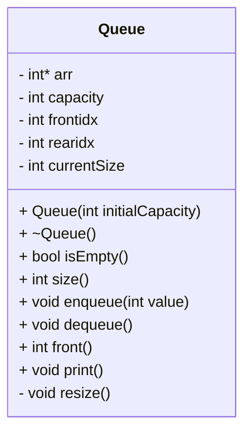

# 📘 Dynamic Circular Queue – C++ Implementation

A clean, efficient, dynamically resizing Circular Queue implementation in C++.
Supports:

Enqueue

Dequeue

Front

Dynamic Resizing

Circular Indexing

Print

Underflow Handling

