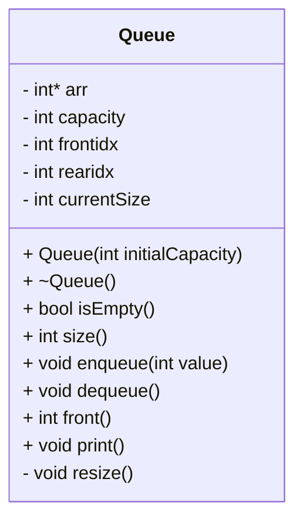
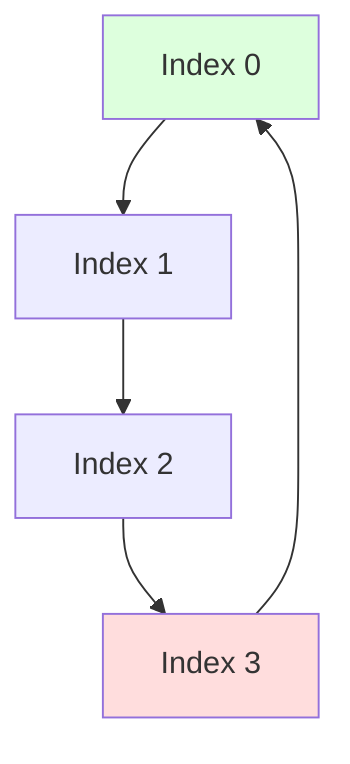
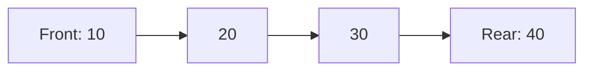
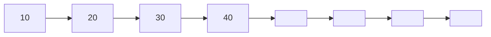
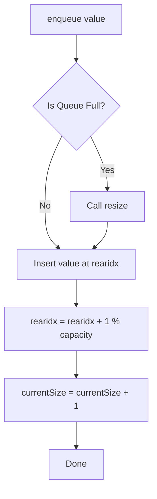
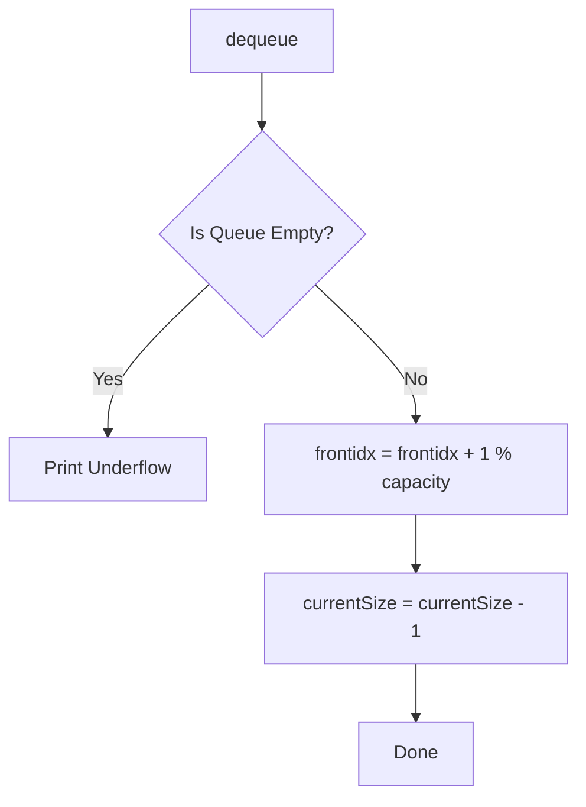

# 📘 Dynamic Circular Queue – C++ Implementation

A clean, efficient, dynamically resizing Circular Queue implementation in C++.
Supports:
Enqueue
Dequeue
Front
Dynamic Resizing
Circular Indexing
Print

# 📌 Features

✔ FIFO (First In First Out)
✔ Dynamic resizing when full
✔ Circular indexing for fast operations
✔ O(1) average time complexity
✔ Memory-safe (no leaks)
✔ Underflow Handling

---

# 🌀 Circular Queue Visualization
## Circular Memory Movement

# 🧱 Queue Example (Front → Rear)

---

# 🚀 Resize Operation (Capacity Doubles)
## Before Resize (Capacity = 4)

---
# 🔄 Enqueue Flowchart (GitHub-Compatible Mermaid)

# 🔁 Dequeue Flowchart

---

# 🧠 Core Concepts Explained
## 1️⃣ Circular Indexing

To avoid shifting elements during dequeue:

(frontidx + i) % capacity

### Benefits:

O(1) dequeue

No shifting

Efficient memory usage

## 2️⃣ Dynamic Resizing

### When queue is full:

Capacity doubles

Elements are copied in correct order

New array replaces old

frontidx = 0

rearidx = currentSize

This makes the queue scalable.

## 3️⃣ Memory Management

Uses new[] to allocate

Uses delete[] in destructor

Prevents memory leaks

---

# 🏁 Conclusion

This project demonstrates:

Circular queue logic

Dynamic memory handling

Efficient enqueue/dequeue operations

Proper modular arithmetic

Clean C++ class design

If you want, I can add:

✅ UML Sequence Diagram
✅ Animated Flowchart
✅ More test cases
✅ Separate .h and .cpp files
✅ Better styling for GitHub

Just tell me!
---
---

