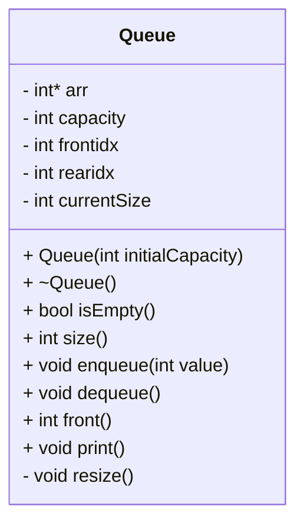
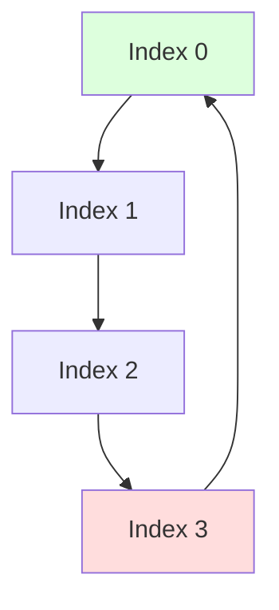
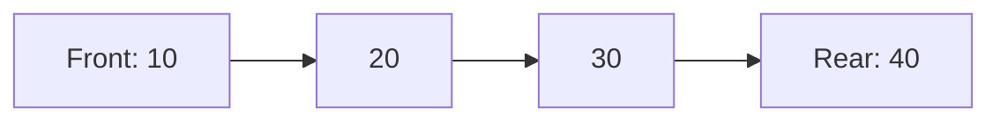
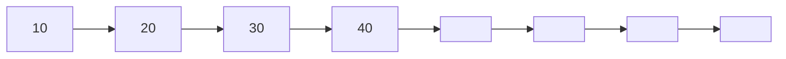

# 📘 Dynamic Circular Queue – C++ Implementation

A clean, efficient, dynamically resizing Circular Queue implementation in C++.
Supports:

Enqueue

Dequeue

Front

Dynamic Resizing

Circular Indexing

Print

# 📌 Features

✔ FIFO (First In First Out)
✔ Dynamic resizing when full
✔ Circular indexing for fast operations
✔ O(1) average time complexity
✔ Memory-safe (no leaks)
✔ Underflow Handling



# 🌀 Circular Queue Visualization
## Circular Memory Movement



# 🧱 Queue Example (Front → Rear)

# 🚀 Resize Operation (Capacity Doubles)
## Before Resize (Capacity = 4)

# Queue Enqueue Flowchart

```mermaid
flowchart TD
    A[enqueue(value)] --> B{Queue Full?}
    B -- Yes --> C[resize()]
    B -- No --> D[Insert at rearidx]
    D --> E[rearidx = (rearidx + 1) % capacity]
    E --> F[currentSize++]
    F --> G[Done]
```
