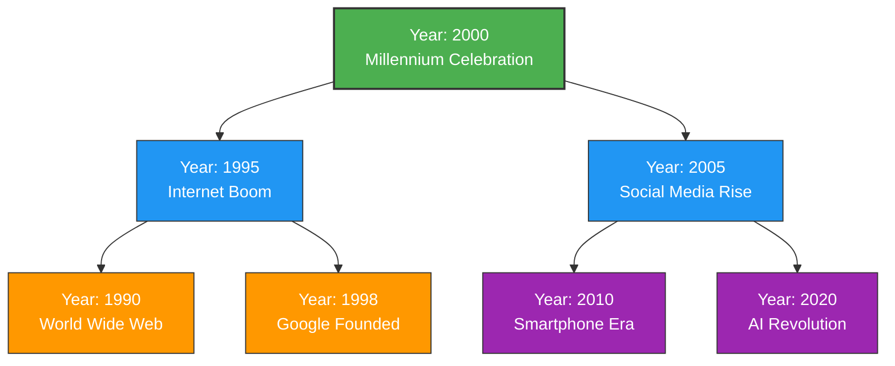
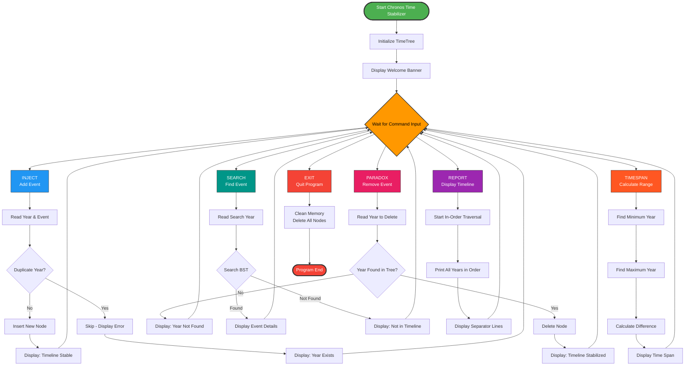
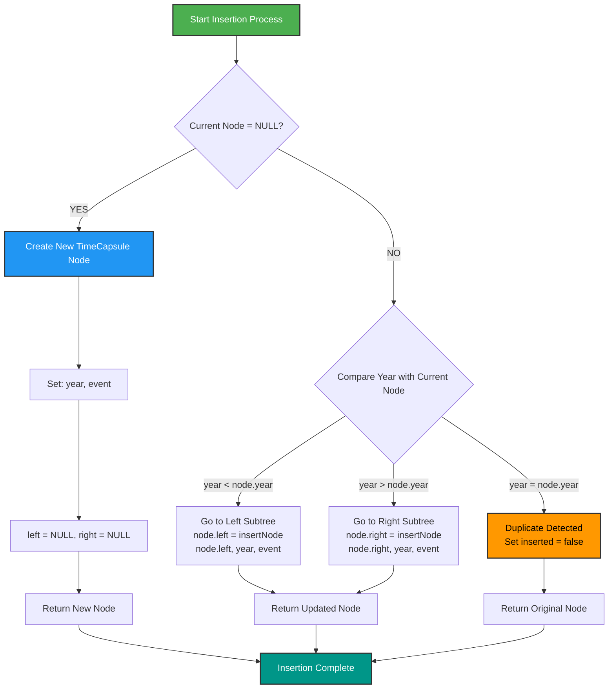
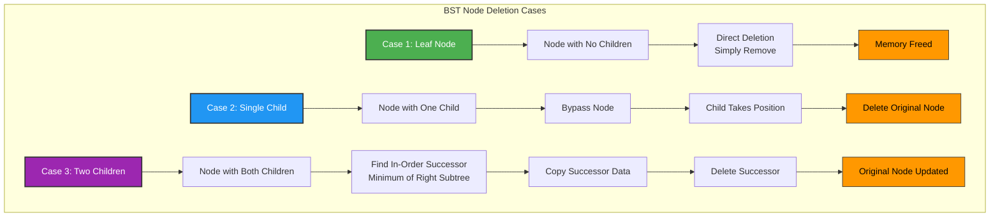
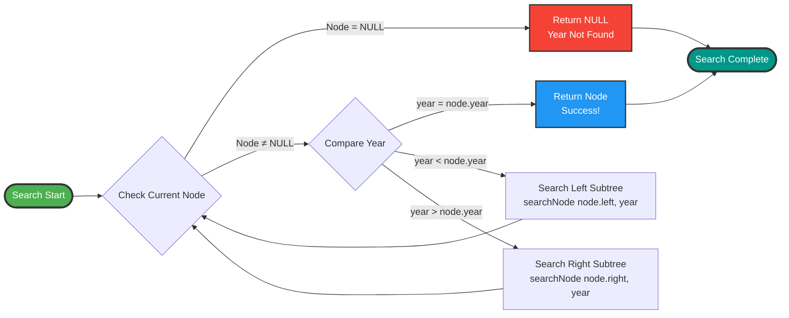
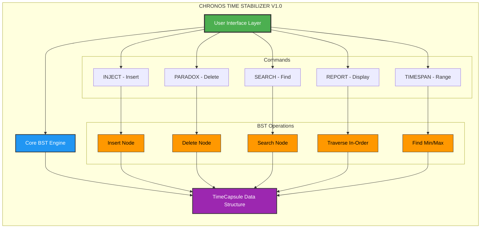
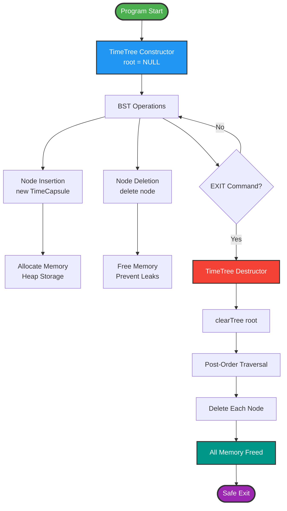
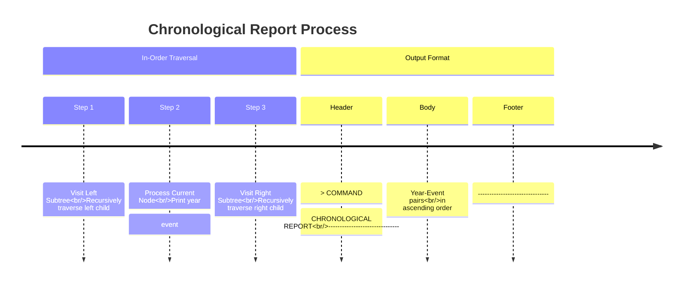

                                           # Chronos Time Stabilizer V1.0.......
---
---

# 📋 Project Overview
Chronos Time Stabilizer V1.0 is a C++ program that implements a Binary Search Tree (BST) to manage historical events organized by year. The system uses time-travel themed terminology to provide an interactive interface for inserting, deleting, searching, and reporting on timeline events.

# 🏗️ Data Structure
TimeCapsule Node Structure
Each node in the BST contains:
This graph shows how events are organized in the Binary Search Tree

### Explanation: The BST organizes events by year, where:

Each node contains a year and event description

Years less than current node go to LEFT subtree

Years greater than current node go to RIGHT subtree

The tree automatically maintains chronological order

Root (2000) is highlighted in green, showing it's the first inserted year

# 📋 2. Complete Program Flowchart
## BST Structure Visualization
This shows the entire program flow from start to end

Explanation: The program follows this sequence:

Starts and initializes the TimeTree

Enters command loop waiting for user input

Processes 6 different commands (INJECT, PARADOX, SEARCH, REPORT, TIMESPAN, EXIT)

Each command triggers specific BST operations

Returns to command loop after each operation

EXIT command cleans memory and ends program

# ➕ 3. Insertion Process:
Shows the recursive algorithm for inserting a new event

### Explanation: The insertNode function works recursively:

If current position is NULL, create new node (base case)

If year < current node's year, go LEFT (recursive call)

If year > current node's year, go RIGHT (recursive call)

If year = current node's year, it's a duplicate (skip)

Returns updated tree structure after insertion

# 4. ❌  Deletion Scenarios
Illustrates the 3 cases handled when deleting a node

### Explanation: The deleteNode function handles 3 scenarios:

Leaf Node: Direct deletion (no children)

One Child: Bypass node, connect child to parent

Two Children: Find in-order successor, replace data, delete successor

In-order successor = smallest node in right subtree

This maintains BST property after deletion

# 🔍 5. Search Algorithm Flow:
Shows how the program searches for a specific year

### Explanation: The searchNode function works recursively:

If node is NULL → year not found (return NULL)

If year = node.year → found! (return node pointer)

If year < node.year → search in left subtree

If year > node.year → search in right subtree

Returns pointer to node if found, NULL if not found

# 🏗️6. Complete System Architecture:

Shows the layered architecture of the entire system

### Explanation: The system has 3 main layers:

### User Interface Layer: Handles command input/output

### Core BST Engine: Implements tree operations

### Data Structure: TimeCapsule nodes

Commands map to specific operations:

INJECT → Insert Node

PARADOX → Delete Node

SEARCH → Search Node

REPORT → In-Order Traversal

TIMESPAN → Find Min/Max

# 🧹 7. Memory Management Flow:
Shows how the program manages dynamic memory

### Explanation: Memory management follows this pattern:

### Constructor: Initializes root to NULL

### During operations:

new TimeCapsule allocates memory for new nodes

delete node frees memory when nodes are removed

Destructor: Called on EXIT command

clearTree performs post-order traversal

Deletes all nodes from bottom-up

Ensures no memory leaks

# 📅 8. Timeline Display Process:
Shows how events are displayed in chronological order

### Explanation: The printInOrder function:

Uses in-order traversal (Left-Root-Right)

Recursively visits left subtree first (earlier years)

Processes current node (prints year: event)

Recursively visits right subtree (later years)

Output is automatically sorted chronologically

---
---
# 🎯 Key Takeaways from the Code Analysis:
### BST Organization: Events are sorted by year automatically

### Recursive Design: All core operations use recursion for elegant tree traversal

### Memory Safety: Proper constructor/destructor pairing prevents leaks

### User-Friendly: Time-travel theme makes technical operations engaging

### Efficiency: BST provides O(log n) operations on average

### Data Integrity: Prevents duplicate years, maintains chronological order

