# 🎓 EduTrack System - Student Performance Tracker
## 📊 Overview
EduTrack System is a C++ based student management and analytics tool that processes academic records to generate insightful reports. The system efficiently organizes student data using linked lists and implements multiple sorting algorithms to categorize students based on various academic metrics.

```mermaid
flowchart TD
    A[students_data.txt<br/>Input File] --> B[EduTrackSystem::loadData]
    B --> C[Create Student Linked List]
    
    C --> D1[Task 1: Rank by CGPA]
    C --> D2[Task 2: Enrollment Sort]
    C --> D3[Task 3: Department Analysis]
    C --> D4[Task 4: Performance Tiers]
    
    D1 --> E1[Use Selection Sort<br/>Sort by: CGPA↓, Credits↓]
    D2 --> E2[Use Bubble Sort<br/>Sort by: Year↑, ID↑]
    D3 --> E3[Use Selection Sort<br/>Sort by: Dept↑, Sem↑, CGPA↓]
    D4 --> E4[Use Bubble Sort<br/>Sort by: Name↑]
    
    E1 --> F1[ranked_by_cgpa.txt]
    E2 --> F2[sorted_by_enrollment.txt]
    E3 --> F3[department_analysis.txt]
    E4 --> F4[performance_tiers.txt]
    
    subgraph "Linked List Structure"
        LL1[Head → Student Node 1 → Student Node 2 → ... → NULL]
    end
    
    subgraph "Student Node"
        SN[id, name, dept<br/>semester, cgpa<br/>credits, year, next*]
    end
    
    C --> LL1
    LL1 --> SN
    
    style A fill:#4CAF50,stroke:#2E7D32,stroke-width:2px
    style B fill:#2196F3,stroke:#0D47A1
    style C fill:#9C27B0,stroke:#4A148C
    style D1 fill:#FF9800
    style D2 fill:#FF9800
    style D3 fill:#FF9800
    style D4 fill:#FF9800
    style E1 fill:#00BCD4
    style E2 fill:#00BCD4
    style E3 fill:#00BCD4
    style E4 fill:#00BCD4
    style F1 fill:#8BC34A
    style F2 fill:#8BC34A
    style F3 fill:#8BC34A
    style F4 fill:#8BC34A
    style LL1 fill:#FFF3E0,stroke:#FF9800
    style SN fill:#E3F2FD,stroke:#2196F3
```




---
  
# ✨ Key Features:
#### 📈 Task 1: University Ranking
#### Algorithm: Selection Sort

## Sorting Criteria:

Primary: CGPA (Descending)

Secondary: Credits Completed (Descending)

Output: ranked_by_cgpa.txt

Format: Ranked list with detailed student information.
# 🎓 Task 2: Enrollment Year Analysis
#### Algorithm: Bubble Sort

### Sorting Criteria:

**Primary:** Enrollment Year (Ascending)

**Secondary:** Student ID (Ascending)

**Output:** sorted_by_enrollment.txt

**Format:** Year-wise grouping with average CGPA per batch.

---

# 🏫 Task 3: Department Performance
#### Algorithm: Selection Sort

## Sorting Criteria:

**Primary:** Department (Alphabetical)

**Secondary:** Semester (Ascending)

**Tertiary:** CGPA (Descending)

**Output:** department_analysis.txt

**Format:** Department-wise analysis with statistics (Avg, High, Low CGPA)

# 🏆 Task 4: Performance Tiers
**Algorithm:** Bubble Sort

**Sorting Criteria:** Name (Alphabetical)

**Output:** performance_tiers.txt

### Categories:

**🥇 Elite Tier: CGPA ≥ 3.70**

**🥈 High Achievers: 3.30 ≤ CGPA < 3.70**

**🥉 Good Standing: 3.00 ≤ CGPA < 3.30**

**📘 Satisfactory: 2.50 ≤ CGPA < 3.00**

**📝 Needs Improvement: CGPA < 2.50**


# 🛠️ Technical Implementation
## Data Structure
```
struct Student {
    int id;           // Student ID
    string name;      // Full name
    string dept;      // Department
    int semester;     // Current semester
    double cgpa;      // Cumulative GPA
    int credits;      // Credits completed
    int year;         // Enrollment year
    Student* next;    // Pointer to next node
};
```

# Input File Example (students_data.txt)

```
101 John Doe CS 5 3.8 90 2020
102 Jane Smith EE 4 3.5 75 2021
103 Bob Wilson ME 6 3.2 110 2019
104 Alice Brown CS 5 3.9 95 2020
105 Charlie Davis CE 3 2.8 50 2022

```
---


# 📁 Output Files
**ranked_by_cgpa.txt - University-wide ranking**

**sorted_by_enrollment.txt - Year-wise student lists with averages**

**department_analysis.txt - Department performance reports
**
performance_tiers.txt - Categorized student performance levels**

# Memory Efficient Design
**Uses linked list for dynamic memory allocation**

**Proper destructor for memory cleanup**
**In-place sorting (no extra arrays)**

# 🎯 Learning Outcomes
### This project demonstrates:

**Data Structures:** Linked list implementation and manipulation

**Algorithms:** Selection Sort and Bubble Sort with custom comparison

**File Handling:** Reading input and writing formatted reports

**Object-Oriented Design:** Class-based system architecture

**Memory Management:** Proper allocation and deallocation

```mermaid
graph LR
    subgraph "Task 1 & 3: Selection Sort"
        A1[Start] --> A2["Find min/max<br/>in unsorted portion"]
        A2 --> A3["Swap with<br/>first unsorted"]
        A3 --> A4["Repeat until<br/>sorted"]
        A4 --> A5["O(n²) time<br/>O(1) space"]
    end
    
    subgraph "Task 2 & 4: Bubble Sort"
        B1[Start] --> B2["Compare<br/>adjacent pairs"]
        B2 --> B3["Swap if<br/>out of order"]
        B3 --> B4["Repeat for<br/>all elements"]
        B4 --> B5["O(n²) time<br/>O(1) space"]
    end
    
    A5 --> C["Stable: No<br/>Adaptive: No<br/>Good for small lists"]
    B5 --> D["Stable: Yes<br/>Adaptive: Yes<br/>Good for nearly sorted"]
    
    style A1 fill:#bbdefb
    style A5 fill:#64b5f6
    style B1 fill:#e1bee7
    style B5 fill:#ba68c8
    style C fill:#c8e6c9
    style D fill:#ffecb3
```



# 🤝 Contributing
**Feel free to fork this project and submit pull requests with:**

**Additional sorting algorithms (Merge Sort, Quick Sort)**

**GUI interface**
**Database integration**

**More analytics features**
