# 🏥 Hospital Emergency Room Queue System
<div align="center">


A sophisticated doubly-linked list implementation for managing patient queues in hospital emergency rooms with intelligent prioritization

</div>

<div align="center">

## System Overview

```mermaid
flowchart TD
    P[Patient Arrival] --> T{Triage}
    T -->|Critical| C[⚡ Add to Front]
    T -->|Normal| N[📝 Add to End]
    
    C --> Q[Queue Management]
    N --> Q
    
    Q --> F[First Patient]
    F --> Tr[Treatment]
    Tr --> D[Discharge]
    
    style P fill:#bbdefb
    style T fill:#ffecb3
    style C fill:#ffcdd2
    style N fill:#c8e6c9
    style Q fill:#e1bee7
    style Tr fill:#b2ebf2
    style D fill:#dcedc8
```



</div>

## Architecture


## 🔄 Workflow


### ⇒ 📋 Table of Contents
### ⇒ 🌟 Overview

### ⇒ 🚀 Features

### ⇒ 🏗️ System Architecture

### ⇒ 💻 Code Implementation

### ⇒ 🎯 Usage Examples

### ⇒ 📊 Performance Analysis

### ⇒ 🔧 Installation & Setup

# ⇒🌟 Overview

 ```mermaid
graph LR
    A[Patient Arrival] --> B{Critical Condition?}
    B -->|Yes| C[Add to Front]
    B -->|No| D[Add to End]
    C --> E[Queue Management]
    D --> E
    E --> F[Treatment]
```
 
The Hospital Emergency Room Queue System is a C++ implementation of a doubly-linked list designed to manage patient queues in a hospital emergency room. This system prioritizes critical patients by adding them to the front of the queue while maintaining efficient operations for normal patient additions and treatments.

## Features
### Core Functionality
**. Critical Patient Management:** Add urgent patients to the front of the queue

**. Normal Patient Management:** Add regular patients to the end of the queue

**. Position-based Insertion:** Insert patients at specific positions in the queue

**. Patient Treatment:** Remove and treat the first patient in line

**. Bidirectional Traversal:** View the queue in both forward and reverse directions

**. Real-time Queue Status:** Monitor current queue state and endpoints
### 🛠️ Advanced Functionality
#### ■ 🎪 Real-time Queue Visualization

#### ■ 📱 Dynamic Memory Management

#### ■ 🛡️ Comprehensive Error Handling

#### ■ 📈 Performance Optimization

#### ■ 🎨 Interactive Status Display

# Data Structure

## ■ Doubly Linked List: Each patient node contains:

```mermaid
graph TB
    subgraph DataStructure [Doubly-Linked List Structure]
        direction LR
        Q[EmergencyQueue] --> F[firstPatient]
        Q --> L[lastPatient]
        
        F --> P1[Patient 150]
        P1 --> P2[Patient 101]
        P2 --> P3[Patient 102]
        P3 --> P4[Patient 300]
        P4 --> NULL[null]
        
        NULL2[null] --> P1
        P2 --> P1
        P3 --> P2
        P4 --> P3
        L --> P4
    end
    
    subgraph Operations[Supported Operations]
        O1[⚡ addCriticalPatient]
        O2[📝 addNormalPatient]
        O3[📍 addPatientAtPosition]
        O4[🏥 treatFirstPatient]
        O5[👀 showQueue]
        O6[🔄 showQueueReverse]
    end
    
    Operations --> DataStructure
    
    style DataStructure fill:#f5f5f5
    style Operations fill:#e3f2fd
    style P1 fill:#e1f5fe
    style P2 fill:#f3e5f5
    style P3 fill:#e8f5e8
    style P4 fill:#fff3e0
```

■ Patient ID (integer)

■ Pointer to previous patient

■ Pointer to next patient

# Class Structure
## EmergencyQueue Class
■ Private Members
**■ firstPatient:** Pointer to the first patient in queue

**■ lastPatient:** Pointer to the last patient in queue

### Public Methods
**※ Constructor & Destructor**

**※ EmergencyQueue():** Initializes empty queue

**※ ~EmergencyQueue():** Cleans up all allocated memory


### Patient Addition Methods

**※ addCriticalPatient(int patientID):** Adds patient to front

**※ addNormalPatient(int patientID):** Adds patient to end

**※ addPatientAtPosition(int patientID, int position):** Inserts at specific position


### Patient Treatment

**✓ treatFirstPatient():** Removes and treats the first patient

### Queue Display Methods

**✓ showQueue():** Displays queue from first to last

**✓ showQueueReverse():** Displays queue from last to first

**✓ showQueueStatus():** Shows complete queue status with first/last patient info

### Utility Methods

**✓ getFirstPatient():** Returns ID of first patient (-1 if empty)

**✓ getLastPatient():** Returns ID of last patient (-1 if empty)
# Empty Queue State

# Single Patient in Queue


# Multiple Patients in Queue (Your Final State)


# Memory Management
**Automatic Cleanup:** Destructor ensures all patient nodes are properly deleted

**No Memory Leaks:** Every new operation has corresponding delete

**Safe Pointer Handling:** Null checks prevent segmentation faults

# Error Handling
**Empty Queue:** Methods handle empty queue scenarios gracefully

**Invalid Positions:** Position validation with meaningful error messages

**Boundary Conditions:** Proper handling of first/last node operations

# Adding Critical Patient

# Adding Normal Patient


---
## Complexity Analysis
### Time Complexity:

#### Add to front/end: O(1)

#### Insert at position: O(n)

#### Treat patient: O(1)

#### Display: O(n)

#### Space Complexity: O(n) where n is number of patients
### 💾 Space Complexity
#### ※ Overall: 🅾️(n) where n is number of patients

#### ※ Per Patient: Constant space for node structure

#### ※ Memory Efficiency: Dynamic allocation optimizes resource usage

## Advantages
**Efficient Prioritization:** Critical patients handled immediately

**Flexible Insertions:** Patients can be inserted at any position

**Bidirectional Navigation:** Easy traversal in both directions

**Dynamic Sizing:** No fixed size limitations

**Memory Efficient:** Only allocates memory for actual patients

This system provides an efficient and flexible solution for managing emergency room patient queues with proper prioritization and comprehensive queue management capabilities.

<div align="center">

    
    🎉 Ready to Revolutionize Emergency Care!
Streamline your hospital's patient flow with this intelligent queue management system

Built with ❤️ for better healthcare experiences

⭐ Star this project if you found it helpful!

</div>
