# 🏥 Hospital Emergency Room Queue System
<div align="center">


A sophisticated doubly-linked list implementation for managing patient queues in hospital emergency rooms with intelligent prioritization

</div>
📋 Table of Contents
🌟 Overview

🚀 Features

🏗️ System Architecture

💻 Code Implementation

🎯 Usage Examples

📊 Performance Analysis

🔧 Installation & Setup
🌟 Overview
# Overview

 ```mermaid
graph LR
    A[Patient Arrival] --> B{Critical Condition?}
    B -->|Yes| C[Add to Front]
    B -->|No| D[Add to End]
    C --> E[Queue Management]
    D --> E
    E --> F[Treatment]
```
 
The Hospital Emergency Room Queue System is a C++ implementation of a doubly-linked list designed to manage patient queues in a hospital emergency room. This system prioritizes critical patients by adding them to the front of the queue while maintaining efficient operations for normal patient additions and treatments.

## Features
### Core Functionality
**. Critical Patient Management:** Add urgent patients to the front of the queue

**. Normal Patient Management:** Add regular patients to the end of the queue

**. Position-based Insertion:** Insert patients at specific positions in the queue

**. Patient Treatment:** Remove and treat the first patient in line

**. Bidirectional Traversal:** View the queue in both forward and reverse directions

**. Real-time Queue Status:** Monitor current queue state and endpoints

# Data Structure

**> Doubly Linked List:** Each patient node contains:

■ Patient ID (integer)

■ Pointer to previous patient

■ Pointer to next patient

```mermaid
graph TB
    A[🚗 Patient Arrives] --> B{🔍 Condition Check}
    B -->|⚡ Critical| C[Front of Queue]
    B -->|📋 Normal| D[End of Queue]
    C --> E[🏥 Queue Management]
    D --> E
    E --> F[💊 Treatment]
    F --> G[✅ Discharge]
    
    style A fill:#e1f5fe
    style B fill:#fff3e0
    style C fill:#ffebee
    style D fill:#e8f5e8
    style E fill:#f3e5f5
    style F fill:#e0f2f1
    style G fill:#e8f5e8
```



# Class Structure
## EmergencyQueue Class
■ Private Members
**■ firstPatient:** Pointer to the first patient in queue

**■ lastPatient:** Pointer to the last patient in queue

### Public Methods
**※ Constructor & Destructor**

**※ EmergencyQueue():** Initializes empty queue

**※ ~EmergencyQueue():** Cleans up all allocated memory


### Patient Addition Methods

**※ addCriticalPatient(int patientID):** Adds patient to front

**※ addNormalPatient(int patientID):** Adds patient to end

**※ addPatientAtPosition(int patientID, int position):** Inserts at specific position


### Patient Treatment

**✓ treatFirstPatient():** Removes and treats the first patient

### Queue Display Methods

**✓ showQueue():** Displays queue from first to last

**✓ showQueueReverse():** Displays queue from last to first

**✓ showQueueStatus():** Shows complete queue status with first/last patient info

### Utility Methods

**✓ getFirstPatient():** Returns ID of first patient (-1 if empty)

**✓ getLastPatient():** Returns ID of last patient (-1 if empty)


